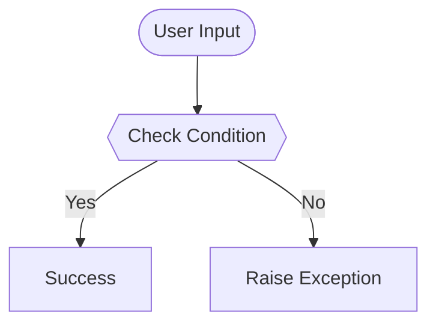

# Day {day} — {title}
  

| **Scope** | **Description** |
|:---------:|:----------------|
|   Goal    | {goal}          |
|   Steps   | {steps}         |
|   Stack   | {stack}         |

## 📘 Table of contents
* [🧠 Concepts Learned](#-concepts-learned)
* [⚠️ Challenges](#-challenges)
* [✅ Solutions / Insights](#-solutions--insights)
* [🏗 Architecture](#-architecture)
* [🎯 Next steps](#-next-steps)

---

## 🧠 Concepts Learned

(Write bullet points here)

## ⚠️ Challenges

(What was confusing / hard)

## ✅ Solutions / Insights

(How you solved it / what finally clicked)

## 🏗 Architecture
(Optional: Remove if not needed for this day)

## 🎯 Next Steps

(Refactors, extra features, things to revisit)

