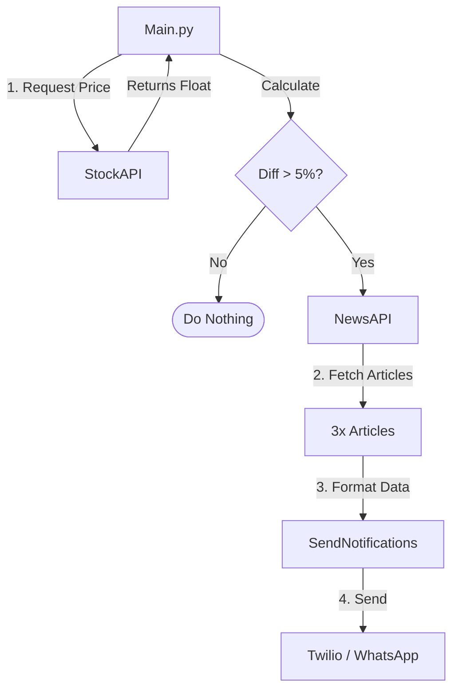

# Day 36 — Trading News Alert 📈
[](../day_36/main.py)  

**Goal**: Build a Bloomberg-style alert system that monitors TSLA stock. If the closing price changes by more than 5%, it fetches relevant news and sends a WhatsApp alert.
1. Fetch latest TSLA prices from Alpha Vantage
2. Compute % change between last two closes 
3. Fetch latest 3 news about Tesla from NewsAPI 
4. Send one WhatsApp message per article via Twilio, with text + link and image when available  

**Stack used**: Python · OOP · Requests · JSON parsing · NewsAPI · Twilio WhatsApp · `.env` configs · Git feature branches


## 📘 Table of contents
* [🧠 Concepts Learned](#-concepts-learned)
* [⚠️ Challenges](#-challenges)
* [✅ Solutions / Insights](#-solutions--insights)
* [🎯 Next steps](#-next-steps)

---

## 🧠 Concepts Learned

### How to design three focused classes:

- `StockAPI` → talks to Alpha Vantage and returns last 2 closing prices as floats. 
- `NewsAPI` → calls NewsAPI and returns a list of 3 clean dicts with `headline/brief/url/media/date`. 
- `SendNotifications` → uses Twilio `Client` to send WhatsApp messages built from those dicts.

### Architecture & Logic Flow
I designed the system using three focused classes to separate concerns. 


### How to parse **time series JSON**:
- Use `data["Time Series (Daily)"]`, sort the keys (dates) descending, pick `dates[0]` and `dates[1]`. 

### How to compute percentage differences cleanly:
- `(now - prev) / prev * 100`, return `(sign_emoji, abs_percentage)`, guard against `prev == 0`.

### Safer JSON handling with .get(key, default) to avoid KeyError when some fields are missing.

### Practical Twilio/WhatsApp usage:
- Sandbox setup, `from_="whatsapp:+..."`, `to="whatsapp:+..."`, `media_url` vs `body`.

Git workflow closer to “real teams”:
- `day-36` base branch + feature branches (`feature/stock_api`, `feature/get_diff`, `feature/news_api`, `feature/notifications_api`). 
- Merge back using `git merge --no-ff` to keep the history branches visible.

## ⚠️ Challenges

### PyCharm + .env hell
- Env vars were not visible in the Python Console even though the plugin was configured. 
- Confusion between “Run in console” and proper Run Configurations.

### Git merge editor popping up in the terminal (Vim)
- git merge --no-ff opened a merge commit message in Vim and I was stuck.

### Twilio sending only one WhatsApp message
- SIDs showed 3 messages, but only 1 arrived on the phone. 
- Media links sometimes ended with weird CDN paths / .webp, and WhatsApp rendering was inconsistent.

## ✅ Solutions / Insights

### Testing strategy upgrade
- Instead of relying on Python Console, I created explicit `test_*.py` scripts (`test_stock_api.py`, `test_news_api.py`, `test_notification_api.py`) with Run Configurations that load `.env`. 
- This is much closer to how “real” projects test slices of functionality.

### Git merge UX
- Rather than wrestling Vim, I used PyCharm’s **Commit UI** to finalize merge commits. 
- Still used `git merge --no-ff` in the terminal for history structure, but wrote messages / confirmed via the IDE.

### Notification loop + media handling
- Added a small delay to avoid rate / delivery weirdness:  
```python
for item in self.message_container:
...
message = client.messages.create(...)
time.sleep(2)
```
- Media logic simplified to match real-world messy URLs:
```python
media = item.get("media")
media_url = None
if media and not media.lower().endswith(".webp"):
media_url = media
```
- Result: 3 separate messages, and images show correctly when the format is supported.

### Folders in Git
- Renamed `logs/` → `daily_logs/` so it’s no longer ignored by `.gitignore` and my day logs are versioned.

## 🎯 Next Steps
- Add a threshold in `main.py`: only trigger News + WhatsApp if `abs(percentage) >= 5`. 
- Make ticker and phone number **configurable** (env vars or CLI args) to reuse the tool for other stocks / contacts. 
- Extract everything into a mini **package-style structure** (`services/stock.py`, `services/news.py`, `services/notify.py`) as a warm-up to more professional project layouts. 
- Later: write **unit tests** (pytest) instead of manual harness scripts, and maybe log runs to a file or DB for a history of alerts.
