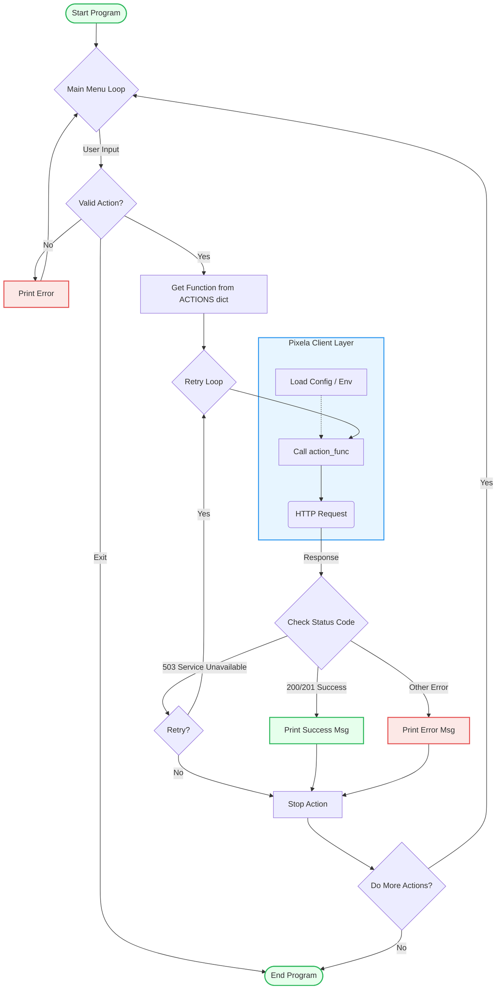

# Day 37 — Habit Tracking App
[](../day_37/main.py)  

| **Scope**  | **Description**                                                                                                                              |
|:----------:|:---------------------------------------------------------------------------------------------------------------------------------------------|
|  **Goal**  | Build a small habit tracking tool that talks to an external API to log my daily habits (e.g. coding time) and visualize progress on a graph. |
| **Steps**  | Implement Pixela habit tracking with user, graph and pixel CRUD.                                                                             |
| **Stack**  | Python, requests, HTTP APIs (Pixela), environment variables (.env / python-dotenv), JSON                                                     |


## 📘 Table of contents
* [🧠 Concepts Learned](#-concepts-learned)
* [⚠️ Challenges](#-challenges)
* [✅ Solutions / Insights](#-solutions--insights)
* [🏗 Architecture](#-architecture)
* [🎯 Next steps](#-next-steps)

---

## 🧠 Concepts Learned
### Project scaffolding automation
- Wrote and refined `new_day_generator.py` to:
  - Create `day_XX/` folders automatically 
  - Auto-generate `main.py` with a clean `if __name__ == "__main__": main()`
  - Auto-generate `config.py` wired with `dotenv`
  - Create `daily_logs/day_XX.md` from a template 
  - Update `README.md` (progress bar + new day entry + links)

### Robust path handling 
- Stopped relying on os.getcwd() and switched to:
  ```python
  REPO_ROOT = os.path.dirname(os.path.abspath(__file__))
  ```
  so the script works from anywhere (PyCharm, terminal, etc.).

### Single .env + dotenv pattern 
- Decided to keep one `.env` at **repo root** instead of one per day.
- Used:
  ```python
  from dotenv import load_dotenv, find_dotenv
  load_dotenv(find_dotenv())
  ```
  in config.py to auto-find and load that root .env.

- Stored all secrets (token, username, etc.) only in .env and accessed via os.getenv.

### Clean config/module structure
- `config.py` as the central place for:
  - `PIXELA_BASE_URL`, `PIXELA_USERNAME`, `PIXELA_TOKEN` 
  - `PIXELA_GRAPH_ID`, habit name/unit/type/color 
- `pixela_client.py` as a small API layer with functions:
  - create_user
  - create_graph
  - add_pixel
  - update_pixel
  - delete_pixel
- main.py as a CLI “conductor” that doesn’t know HTTP details.

### HTTP responses and JSON handling
- Understood the difference between:
  - `response.text` → raw JSON string
  - `response.json()` → parsed Python dict
- Fixed the "string indices must be integers" bug by using:
    ```python
    data = response.json()
    data["message"]
    ```

### CLI architecture & control flow

- Used a dispatch dict:
    ```python
    
    ACTIONS = {
        "create": create_user,
        "graph": create_graph,
        "add": add_pixel,
        "update": update_pixel,
        "delete": delete_pixel,
    }
    ```
- Replaced recursive `main()` calls with:
  - An outer `while True` for the menu
  - An inner `while True` to retry the same action on `503`
- Learned the different roles of:
  - `continue` → restart current loop iteration
  - `break` → exit current loop
  - `return` → exit the entire function, even from inside an if in a while

### API design thinking
- Noted that Pixela’s `PUT` behaves like **upsert** (create or update).
- Discussed designing a simple `upsert_pixel("today" | "other")`:
  - Let the function decide date based on the when argument.
- Chose the simple, readable approach:
    ```python
    choice = input("[T]oday or [O]ther day? ").lower().strip()
    if choice == "t":
        response = upsert_pixel("today")
    elif choice == "o":
        response = upsert_pixel("other")
    ```

## ⚠️ Challenges

### Confusion about JSON vs string
- Tried `response.text['message']` and hit:
  > `TypeError: string indices must be integers, not 'str'`

  - Needed to internalize that response.text is a string, not a dict.

### **Control flow** in `while True`
 - Unclear at first:
   - What actually repeats the loop
   - How `break`, `continue`, and `return` differ in nested contexts.
 - Especially: “If `return` is inside the `while` inside `main()`, does it stop all of `main()`?” (Answer: **yes**.)

### Avoiding recursive main()
- Started with `main()` calling `main()` on:
  - invalid input
  - retry after 503
  - “do again? yes”
- This worked but was dangerous (stack growth, messy flow).

### Handling invalid actions safely
- Initially printed an error for invalid `pick_action` but still tried:
    ```python
    action_func = ACTIONS[pick_action]
    ```
- That would cause a `KeyError`.

## ✅ Solutions / Insights

### Proper JSON access
- Switched to:
    ```python
    data = response.json()
    print(data["message"])
    ```
- Mental model:

  - `text` = string, good for raw logging.
  - `json()` = dict/list, good for accessing fields.

### Nested while loops instead of recursion
- Designed:
  - Outer loop: menu (“What do you want to do today?”)
  - Inner loop: retry the **same** action on `503`

- Pattern:
    ```python
    while True:          # menu loop
        ...
    
        while True:      # retry this specific action
            response = action_func()
            if response.status_code == 503:
                # ask retry Y/N, continue or break
            else:
                # handle and break
    ```

### Safe invalid input handling
- Added `continue` after invalid action:
    ```python
    if pick_action not in ACTIONS:
        print("😐 Dude, please spell one of the available words and don't include the brackets.\n")
        continue
    ```
- Ensured response is always set before checking response.status_code.

### HTTP status robustness
Considered that APIs often return 201 for creation:
    ```python
    if response.status_code in (200, 201):
        print("We did it 🥳")
    else:
        # error
    ```

### Architecture choices are about clarity, not fanciness
- I _could_ use `lambda` or `partial` to pre-store arguments, but I chose:
```python
if choice == "t":
    upsert_pixel("today")
elif choice == "o":
    upsert_pixel("other")
```
- Which is absolutely fine at “industrial” level because it’s easy to read and reason about.

## 📂 Project Structure
```
day_37/
├── main.py
├── config.py
├── pixela_client.py
```

## 🏗 Architecture


## 🎯 Next Steps
When you come back for Day 38 (or a Day 37 “refinement” session), good follow-ups could be:
- Refine pixela_client 
  - Extract user input out of `add_pixel` / `update_pixel` / `delete_pixel` so they become pure functions:
    ```python
    def add_pixel(date, quantity): ...
    ```

- Keep all `input()` logic in `main.py`. This will prepare your code for future tests with `pytest`.

- **Implement** `upsert_pixel(when)`
  - Centralize “today vs other day” logic and use that in the CLI.
  - Optionally log today by default without asking.

- First tiny test
  - Add a super simple test file (even without hitting Pixela, maybe just testing that URLs are formed correctly).
  - Just to start getting used to how pytest works.

- Revisit GitHub Actions later
  - Once you have at least one test, we can wire a small CI that runs your tests on every push using GitHub Actions.  

---
[](day_36.md) [](day_38.md)
