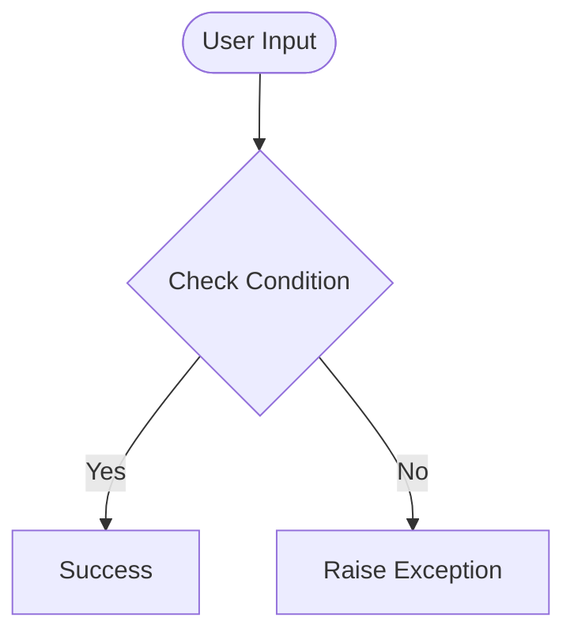

# Day 38 — Workout Tracking App w/ Google Sheet
[](../day_38/main.py)  

| **Scope** | **Description**                                                                                                                              |
|:---------:|:---------------------------------------------------------------------------------------------------------------------------------------------|
|   Goal    | Turn a natural-language workout description into structured data and log each exercise (date, time, duration, calories) into a Google Sheet. |
|   Steps   | Send the user’s sentence to the Exercise API, then POST each parsed exercise with timestamp and calories to the Google Sheets API.           |
|   Stack   | Python 3, `requests`, `datetime`, environment variables, Exercise API, Sheety/Google Sheets.                                                 |


## 📘 Table of contents
* [🧠 Concepts Learned](#-concepts-learned)
* [⚠️ Challenges](#-challenges)
* [✅ Solutions / Insights](#-solutions--insights)
* [🏗 Architecture](#-architecture)
* [🎯 Next steps](#-next-steps)

---

## 🧠 Concepts Learned

(Write bullet points here)

## ⚠️ Challenges

(What was confusing / hard)

## ✅ Solutions / Insights

(How you solved it / what finally clicked)

## 📂 Project Structure
```
day_38/
├── main.py
├── config.py
```

## 🏗 Architecture


## 🎯 Next Steps

(Refactors, extra features, things to revisit)

---
[](day_37.md) [](day_39.md)
