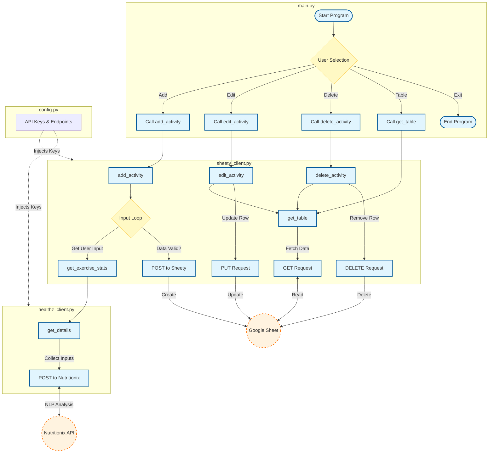

# Day 38 — Workout Tracking App w/ Google Sheet
[](../day_38/main.py)  

| **Scope** | **Description**                                                                                                                              |
|:---------:|:---------------------------------------------------------------------------------------------------------------------------------------------|
|   Goal    | Turn a natural-language workout description into structured data and log each exercise (date, time, duration, calories) into a Google Sheet. |
|   Steps   | Send the user’s sentence to the Exercise API, then POST each parsed exercise with timestamp and calories to the Google Sheets API.           |
|   Stack   | Python 3, `requests`, `datetime`, environment variables, Exercise API, Sheety/Google Sheets.                                                 |


## 📘 Table of contents
* [🧠 Concepts Learned](#-concepts-learned)
* [⚠️ Challenges](#-challenges)
* [✅ Solutions / Insights](#-solutions--insights)
* [📂 Project Structure](#-project-structure)
* [🏗 Architecture](#-architecture)
* [🎯 Next steps](#-next-steps)

---

## 🧠 Concepts Learned

### Error handling patterns
Using `while True:` + `try/except` + validation loops to handle bad/empty input, wrong types, and yes/no confirmations cleanly across multiple functions.

### Config & environment separation
Moved URLs, API keys, and error-code descriptions into a dedicated `config.py`, keeping logic files clean.

### API client structure
- One client for the exercise/nutrition API (building headers, sending POST, returning the response). 
- One client for Sheety/Google Sheets that handles GET/POST/PUT/DELETE and returns structured data.

### Working with tabular data
Using `pandas.DataFrame` as the representation of the sheet so you can display and index rows like a “real” table.

### CLI design & flow
Built a small console “app” with a menu, logo, commands (Add/Edit/Delete/Table/Exit), and clean re-prompt flows.

## ⚠️ Challenges
### Designing robust input flows:
Preventing empty strings, wrong types (e.g. letters instead of numbers), and invalid gender values.

### Handling API failure modes
Non-200 status codes, malformed responses, or “no exercises found” errors without crashing.  
Mapping between user-facing row numbers and the internal Sheety row IDs, especially for edit/delete operations.

## ✅ Solutions / Insights
### Standardized a pattern:
- `while True:` → get input 
- validate (type, allowed values, not empty)
- `break` only when input is acceptable; otherwise print a friendly error and loop.

### Treated APIs like real services:
- Checked `status_code` before `.json()`
- Printed clear messages when an error happened and retried sensibly. 

### Used pandas to make editing/deleting easier:
- Display the sheet as a table, 
- Let the user pick a row by index, 
- Look up the underlying id to call Sheety correctly.

Realized you can now feel what’s “cosmetic error” vs “real drama” in the terminal → less panic, more reasoning.

## 📂 Project Structure
```
day_38/
├── main.py
├── config.py
├── healthz_client.py
├── sheety_client.py
└── test/
    └── test_healthz_client.py
```

## 🏗 Architecture


## 🎯 Next Steps
Consider Day 38 done – you overshot the brief in a good way.  
For upcoming projects:
- First implement exactly what Angela asks (MVP), 
- Then, if you have time, add only one extra feature (better structure, a small UX improvement, or one “pro” function), time-boxed.

Move on to Day 39 with this rule in mind so you keep momentum and don’t sink full-product effort into every mini-project.

---
[](day_37.md) [](day_39.md)
