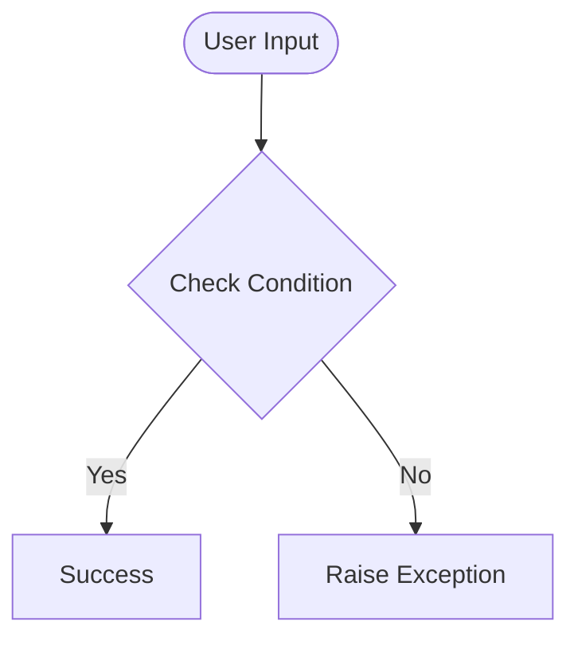

# Day 39 — Flight Deal Finder
[](../day_39/main.py)  

| **Scope** | **Description** |
|:---------:|:----------------|
|   Goal    | Build a tool that monitors flight prices and alerts you when they drop below a target price by querying a flight search API and comparing results to stored thresholds.          |
|   Steps   | Store destination data (e.g. in Google Sheets), connect to the flight API, fetch and parse prices, compare to thresholds, and trigger notifications (email/SMS) for deals.         |
|   Stack   | `Python`, `requests`, Tequila/Kiwi flight API, Google Sheets + Sheety, environment variables for API keys         |


## 📘 Table of contents
* [🧠 Concepts Learned](#-concepts-learned)
* [⚠️ Challenges](#-challenges)
* [✅ Solutions / Insights](#-solutions--insights)
* [🏗 Architecture](#-architecture)
* [🎯 Next steps](#-next-steps)

---

## 🧠 Concepts Learned

(Write bullet points here)

## ⚠️ Challenges

(What was confusing / hard)

## ✅ Solutions / Insights

(How you solved it / what finally clicked)

## 📂 Project Structure
```
day_39/
├── main.py
├── config.py
```

## 🏗 Architecture


## 🎯 Next Steps

(Refactors, extra features, things to revisit)  

---
[](day_38.md) [](day_40.md)
