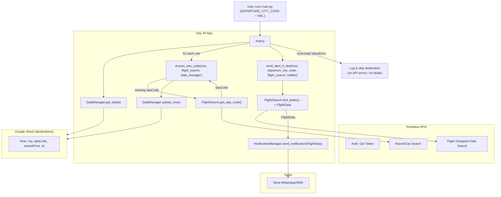

# Day 39 — Flight Deal Finder
[](../day_39/main.py)  

| **Scope** | **Description**                                                                                                                                                                  |
|:---------:|:---------------------------------------------------------------------------------------------------------------------------------------------------------------------------------|
|   Goal    | Build a tool that monitors flight prices and alerts you when they drop below a target price by querying a flight search API and comparing results to stored thresholds.          |
|   Steps   | Store destination data (e.g. in Google Sheets), connect to the flight API, fetch and parse prices, compare to thresholds, and trigger notifications (email/SMS) for deals.       |
|   Stack   | `Python` (OOP, `requests`, `datetime`, `env vars`), Google Sheets + Sheety API, Amadeus Flight Search API, Twilio SMS/WhatsApp API.                                               |


## 📘 Table of contents
* [🧠 Concepts Learned](#-concepts-learned)
* [⚠️ Challenges](#-challenges)
* [✅ Solutions / Insights](#-solutions--insights)
* [🏗 Architecture](#-architecture)
* [🎯 Next steps](#-next-steps)

---

## 🧠 Concepts Learned
- How to structure a script into **main + helper functions** (`ensure_iata_code`, `send_alert_if_deal`) instead of dumping everything in `main.py`.
- Using **Amadeus APIs**:
  - Auth flow with `client_id`, `client_secret`, and token endpoint.
  - Cheapest–date search and Airport/City search endpoints.
- Designing a small **domain object** (`FlightData`) to pass clean data between modules instead of raw JSON.
- Practical **HTTP error handling**:
  - Catching `requests.HTTPError` and re-raising as `ValueError` with clean messages.
  - Using `raise ... from err` to preserve the original traceback.
- Handling **empty API results** gracefully (e.g. `data == []` ➜ `ValueError("No IATA code found...")`).
- Pattern: main loop + `try/except` so one bad destination **doesn’t kill** the entire process.
- How SaaS APIs behave under limits/quotas (Sheety 402 *“Payment Required”*).

## ⚠️ Challenges
- **Sheety root key confusion**: sheet name vs JSON root key (`prices` vs `price`), and figuring out why the payload was rejected.
- Hitting the **Sheety free-tier quota** and suddenly getting `402 Payment Required` errors.
- **Amadeus 500 errors** on the Cheap Date endpoint (worked, then started returning internal errors for some routes).
- Airport/City search returning **empty data for some cities** (Tokyo, Hong Kong) even though IATA shows metro codes (`TYO`, `HKG`).
- Keeping the code readable while handling:
  - token generation,
  - multiple HTTP calls,
  - error propagation,
  - Twilio notifications.

## ✅ Solutions / Insights
- **Sheety payload fix**
  - Read their docs carefully and used the **sheet name as JSON root key**.
  - Confirmed behavior by creating a dummy sheet (`ggg`) and testing POST/PUT until the JSON shape matched exactly.

- **Robust Sheety error handling**
  - Wrapped `get_table()` and `update_row()` in `try/except requests.HTTPError`.
  - Translated errors into clear `ValueError` messages like:
    > `Sheety error here: 402 - Monthly quota has been reached. Please upgrade...`
  - Treated 402 as **fatal** at startup so the program fails loudly instead of half-running.

- **Amadeus 500 handling**
  - Checked `response.ok` instead of blindly calling `raise_for_status()`.
  - When not ok: raised `ValueError(f"Amadeus Error: {status}, {body}")`.
  - In `main()`, caught that `ValueError`, printed a “Skipping destination…” message, and continued to the next row.

- **Empty IATA results (Tokyo, Hong Kong)**
  - Confirmed via official IATA site that metro codes exist (TYO, HKG).
  - Amadeus sandbox returns `data: []` ➜ added:
    ```python
    if not data:
        raise ValueError(f"No IATA code found for city: {city_name}")
    ```
  - In `main()`, this just logs and skips that city.

- **Refactoring into helpers + main**
  - `ensure_iata_code(...)` now:
    - fetches missing IATA from Amadeus,
    - updates the row via Sheety,
    - returns the code.
  - `send_alert_if_deal(...)`:
    - calls `find_deals`,
    - sends Twilio alert,
    - returns the message SID.
  - `main()` is now a clear high-level orchestration function.

## 📂 Project Structure
```text
day_39/
├── config.py
├── data_manager.py
├── flight_data.py
├── flight_search.py
├── main.py
├── notification_manager.py
└── test_flight_api.py
```

## 🏗 Architecture


## 🎯 Next Steps
- Add a **CLI input** or config for `DEPARTURE_CITY_CODE` instead of hardcoding `"MIL"`. 
- Cache the Amadeus **access token** inside `FlightSearch` so multiple requests reuse it instead of hitting the auth endpoint every time. 
- Add a “**dry run**” mode that prints which alerts would be sent without calling Twilio (useful when debugging). 
- Persist some kind of **last-sent timestamp** per route to avoid spamming alerts every time the script runs. 
- Start adding **unit tests**:
  - mock requests and Twilio, 
  - test edge cases: 500s, empty data, quota errors, etc.

---
[](day_38.md) [](day_40.md)
