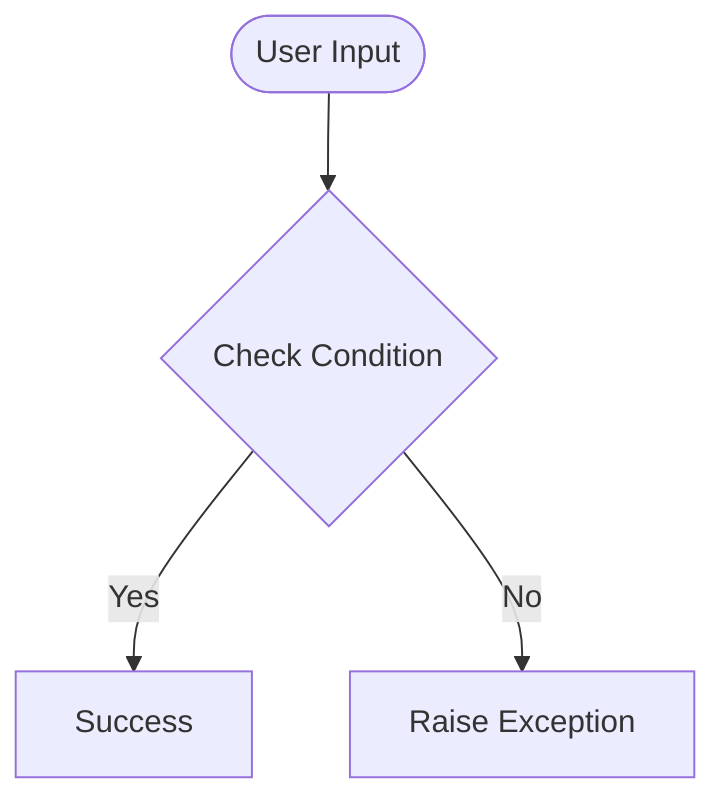

# Day 40 — Capstone: Flight Club – Users & Email Alerts
[](../day_40/main.py)  

| **Scope** | **Description** |
|:---------:|:----------------|
|   Goal    | Upgrade yesterday's personal flight deal finder into a multi-user "Flight Club" service. Let users sign up with name and email and receive cheap flight alerts automatically.          |
|   Steps   | Collect user details (name, email) and store them in a separate users sheet via the Sheety API. Reuse the flight search + price check logic and integrate the SMTP module to email all users when a new deal is found.         |
|   Stack   | Python, requests, SMTP, Sheety API, flight search API (Amadeus/Tequila). Use environment variables for API keys and email credentials.         |


## 📘 Table of contents
* [🧠 Concepts Learned](#-concepts-learned)
* [⚠️ Challenges](#-challenges)
* [✅ Solutions / Insights](#-solutions--insights)
* [🏗 Architecture](#-architecture)
* [🎯 Next steps](#-next-steps)

---

## 🧠 Concepts Learned

(Write bullet points here)

## ⚠️ Challenges

(What was confusing / hard)

## ✅ Solutions / Insights

(How you solved it / what finally clicked)

## 📂 Project Structure
```
day_40/
├── main.py
├── config.py
```

## 🏗 Architecture


## 🎯 Next Steps

(Refactors, extra features, things to revisit)  

---
[](day_39.md) [](day_41.md)
