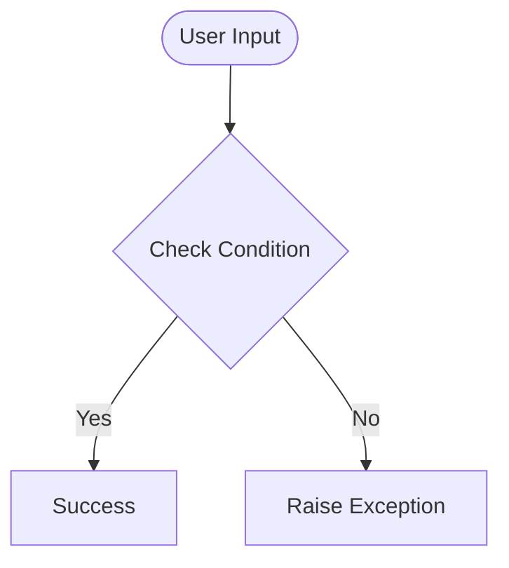

# Day 41 — Introduction to HTML
[](../day_41/main.py)  

| **Scope** | **Description** |
|:---------:|:----------------|
|   Goal    | Understand basic HTML structure and build a simple personal webpage following Angela's lesson.          |
|   Steps   | Generate day_41, create index.html, follow Angela to add headings/text/links, then open the page in the browser to verify it works.         |
|   Stack   | VS Code, HTML, web browser (Python only for the generator script).         |


## 📘 Table of contents
- [Day 41 — Introduction to HTML](#day-41--introduction-to-html)
  - [📘 Table of contents](#-table-of-contents)
  - [🧠 Concepts Learned](#-concepts-learned)
  - [⚠️ Challenges](#️-challenges)
  - [✅ Solutions / Insights](#-solutions--insights)
  - [📂 Project Structure](#-project-structure)
  - [🏗 Architecture](#-architecture)
  - [🎯 Next Steps](#-next-steps)

---

## 🧠 Concepts Learned
- Refreshed the absolute basics of HTML structure (doctype, html/head/body).
- Reviewed semantic elements like headings, paragraphs, void elements (`<hr />`).
- Reinforced the idea that HTML is purely structural and intentionally minimal at this stage.
- Practiced writing a small, clean static page following a consistent hierarchy.
- Understood VS Code workflow for editing and previewing HTML without relying on PyCharm.


## ⚠️ Challenges

(What was confusing / hard)

## ✅ Solutions / Insights

(How you solved it / what finally clicked)

## 📂 Project Structure
```
day_41
├── 2.1 Heading Element
│   ├── goal_headings.png
│   └── index.html
├── 2.2 Paragraph Element
│   ├── goal_paragraphs.png
│   └── index.html
├── 2.3 Void Elements
│   ├── goal_void.png
│   └── index.html
├── 2.4 Movie Ranking Project
│   └── index.html
├── config.py
└── main.py
```

## 🏗 Architecture


## 🎯 Next Steps

(Refactors, extra features, things to revisit)  

---
[](day_40.md) [](day_42.md)
