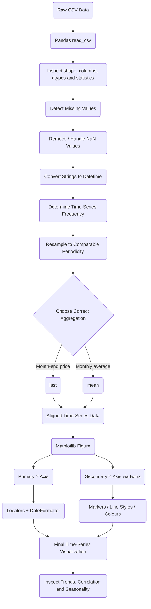

# Day 75 — Google Trends + Time Series Data <!-- omit in toc -->

[](../day_75/main.py)

| **Scope** | **Description**                                                                                                                                                                                                                                                                             |
| :-------: | :------------------------------------------------------------------------------------------------------------------------------------------------------------------------------------------------------------------------------------------------------------------------------------------ |
|   Goal    | Analyze and compare Google Trends search popularity with real-world time-series data such as Bitcoin prices, Tesla stock prices, and US unemployment rates.                                                                                                                                 |
|   Steps   | Load and inspect multiple CSV datasets, identify and handle missing values, resample time series to matching periodicities, merge and compare related datasets, and visualize trends using customized Matplotlib charts with dual axes, date locators, grids, labels, markers, and styling. |
|   Stack   | Python, Pandas, Matplotlib, time-series analysis, datetime indexes, resampling, NaN handling, Matplotlib Locators                                                                                                                                                                           |

## 📘 Table of contents <!-- omit in toc -->

- [🧠 Concepts Learned](#-concepts-learned)
- [⚠️ Challenges](#️-challenges)
- [✅ Solutions / Insights](#-solutions--insights)
- [📂 Project Structure](#-project-structure)
- [🏗 Architecture](#-architecture)
- [🎯 Next Steps](#-next-steps)

---

## 🧠 Concepts Learned

- Used `.describe()` to quickly inspect descriptive statistics such as count, mean, standard deviation, quartiles, minimum, and maximum.
- Learned what **periodicity / frequency** means in time-series data: the interval between observations, such as daily, weekly, or monthly.
- Converted string dates into actual datetime values with:

  ```python
  pd.to_datetime(...)
  ```

- Learned that a Pandas datetime dtype such as:

  ```text
  datetime64[us]
  ```

  represents timestamps stored with microsecond precision.

- Used `.diff()` on datetime columns to inspect the elapsed time between observations.

- Used:

  ```python
  pd.infer_freq(...)
  ```

  to let Pandas infer time-series frequency.

- Learned important Pandas frequency aliases:

  ```text
  MS -> Month Start
  ME -> Month End
  ```

- Learned what a Google Trends score actually represents:
  - `100` means **peak relative search interest** for the selected term, geography, and time range.
  - It does **not** mean 100 searches or 100%.
  - Google Trends values are normalized relative measures rather than raw search counts.

- Used `.isna()` to detect missing values and learned several ways of asking different questions:

  ```python
  df.isna().any().any()
  ```

  checks whether any missing value exists anywhere.

  ```python
  df.isna().sum().sum()
  ```

  counts all missing values.

  ```python
  df[df.isna().any(axis=1)]
  ```

  returns all rows containing at least one missing value.

- Used `.dropna()` to remove rows containing missing data.

- Used `.resample()` to convert daily Bitcoin prices into monthly observations so they could be meaningfully compared with monthly Google Trends data.

- Learned that the aggregation chosen during resampling changes the meaning of the resulting dataset:

  ```python
  .mean()
  ```

  means average daily price during the month, while:

  ```python
  .last()
  ```

  gives the last available observation in each month and is therefore more appropriate when representing a month-end closing price.

- Learned that after:

  ```python
  df.resample("ME", on="DATE")
  ```

  Pandas moves the resampling time dimension into the **index**.

- Learned that using a datetime index is natural and useful for time-series analysis because it enables operations such as:

  ```python
  df.loc["2020"]
  df.resample(...)
  df.shift(...)
  df.rolling(...)
  ```

- Learned the difference between a **DataFrame index** and a **database primary key**:
  - an index helps organize and query analytical data;
  - a primary key guarantees uniqueness in a data model.

- Discovered the concept of **data grain**:

  > First ask what one row represents, then determine what uniquely identifies that row.

  Examples:

  ```text
  Market price       -> DATE + TICKER
  Inventory snapshot -> DATE + WAREHOUSE + SKU
  Sensor observation -> TIMESTAMP + SENSOR_ID
  Order line         -> ORDER_ID + LINE_NUMBER
  ```

- Learned that a key does not necessarily have to be a single business field. Relational databases can use **composite keys**, for example:

  ```text
  PRIMARY KEY (DATE, TICKER)
  ```

- Learned the analogous Pandas concept:

  ```python
  df.set_index(["DATE", "TICKER"])
  ```

  which creates a `MultiIndex`.

- Learned an important difference with Excel / Power Pivot / Power BI data modelling: relationships normally require a **single key column**, so composite business keys are often materialized into something such as:

  ```text
  2026-09-01|BTC
  ```

- Learned the distinction between:
  - natural/composite keys,
  - concatenated relationship keys,
  - surrogate integer/UUID keys.

- Adopted a useful data-engineering rule:

  > **Define the grain first. Define the key second.**

- Learned the more explicit object-oriented Matplotlib style:

  ```python
  fig, ax1 = plt.subplots(...)
  ax2 = ax1.twinx()
  ```

  instead of relying on global state through:

  ```python
  plt.figure(...)
  plt.gca()
  ```

- Learned that:

  ```python
  ax2 = ax1.twinx()
  ```

  creates a second y-axis while sharing the same x-axis.

- Used `tick_params()` to configure individual axes rather than relying entirely on global `plt.xticks()` / `plt.yticks()` configuration.

- Learned the difference between a Matplotlib **Locator** and **Formatter**:

  > Locator = where ticks appear.
  > Formatter = how tick labels are displayed.

- Used:

  ```python
  mdates.YearLocator()
  mdates.MonthLocator()
  mdates.DateFormatter("%Y")
  ```

  to explicitly control time-axis ticks.

- Learned that explicit locators may visually resemble Matplotlib's automatic date ticks because Matplotlib's automatic locator may already choose a similar yearly interval. The benefit is **deterministic control**, not necessarily a dramatic visual difference.

- Customized plots using:
  - figure size,
  - DPI,
  - axis limits,
  - labels,
  - title,
  - linewidth,
  - named colours,
  - HEX colours,
  - dashed lines,
  - markers,
  - grids.

- Used:

  ```python
  linestyle="--"
  marker="o"
  ```

  to visually distinguish series.

- Used:

  ```python
  ax.grid(...)
  ```

  to make time-series patterns easier to identify.

- Learned the distinction between:
  - **trend** — long-term direction,
  - **seasonality** — repeating behaviour at regular intervals,
  - **noise** — irregular variation.

- Practiced comparing Google search interest with:
  - Tesla stock prices,
  - Bitcoin prices,
  - U.S. unemployment rates.

## ⚠️ Challenges

- Initially did not know what the course meant by **periodicity** because it was a familiar idea presented with unfamiliar terminology.
- Needed to understand why monthly observations produce differences of 28, 29, 30, or 31 days even though the time series is still monthly.
- Needed to understand why Google Trends uses a `0–100` scale and why `100` does not mean an absolute number of searches.
- Found that installing the Jupyter Keymap extension in VS Code did not automatically provide shortcuts for every notebook operation.
- Discovered that VS Code exposes both:
  - native `Notebook: Execute ...` commands,
  - Jupyter-extension `Jupyter: Run ...` commands,

  which can have slightly different names and no default keybindings.
- Needed to understand why `.resample()` made `DATE` appear outside the normal DataFrame columns.
- Initially used `.mean()` when resampling Bitcoin data before realizing that an average monthly close and a month-end close represent different business meanings.
- Needed to reason about whether a date should become an index, primary key, foreign key, or part of a composite key.
- Discovered that simplified tutorials often avoid real-world problems where one field is not sufficient to uniquely identify a row.
- Initially placed the Bitcoin marker on the price series instead of the search series.
- Needed to distinguish custom `dashes=[...]` from using the simpler `linestyle="--"` requested by the challenge.
- Encountered a particularly confusing Jupyter bug where the 2020 unemployment CSV clearly contained 2020 data, while the DataFrame unexpectedly ended in 2019.
- Several 2020 values appeared as `NaT`, which initially looked like a datetime parsing failure.
- Jupyter's persistent kernel state made the problem harder to understand because later cells operated on an already-modified DataFrame.
- Variable naming initially made the missing-value checks confusing because `df_bitcoin_isna` referred only to `df_btc_search`, while Bitcoin price data was stored separately.

## ✅ Solutions / Insights

- Converted date columns explicitly before performing time-series operations:

  ```python
  df["MONTH"] = pd.to_datetime(df["MONTH"])
  ```

- Verified periodicity rather than simply assuming it from visually inspecting the dates:

  ```python
  df["MONTH"].diff()
  pd.infer_freq(df["MONTH"])
  ```

- Understood that monthly frequency is a calendar concept rather than a fixed number of elapsed days.

- Improved Matplotlib code by using the object-oriented API:

  ```python
  fig, ax1 = plt.subplots(...)
  ax2 = ax1.twinx()
  ```

  This makes ownership of each configuration option explicit and scales better when charts become more complicated.

- Kept the resampled Bitcoin date as the index rather than immediately calling `.reset_index()`, because a datetime index is useful and idiomatic for time-series analysis.

- Chose:

  ```python
  df_btc_price.resample("ME", on="DATE").last()
  ```

  after reasoning about the **meaning of the aggregation**, rather than choosing an aggregation purely because it worked technically.

- Improved chart limits by deriving them from the actual plotted data and adding headroom:

  ```python
  ax1.set_ylim(
      bottom=0,
      top=df_btc_monthly_price.CLOSE.max() * 1.1
  )
  ```

- Carried date Locators and Formatters into subsequent plots so axis formatting remained deterministic.

- Learned to use the actual resampled dataset when determining x-axis limits instead of using the original daily dataset.

- Improved missing-value inspection from a column-specific query:

  ```python
  df[df.CLOSE.isna()]
  ```

  to a general row-level query:

  ```python
  df[df.isna().any(axis=1)]
  ```

- Found the source of the 2020 unemployment bug:

  ```python
  df_unemployment_20["MONTH"] = pd.to_datetime(
      df_unemployment_19["MONTH"]
  )
  ```

  accidentally assigned the **2019 dataframe's dates into the 2020 dataframe**.

- Learned one of the most important Pandas behaviours encountered today:

  > **Pandas aligns Series assignments by index.**

  Because the source DataFrame was shorter, unmatched rows in the destination became:

  ```text
  NaT
  ```

- Realized that calling `pd.to_datetime()` again could not restore lost dates because the original strings had already been overwritten in memory.

- Recovered the dataframe correctly by reloading the CSV and converting its own column:

  ```python
  df_unemployment_20 = pd.read_csv(
      "data/UE Benefits Search vs UE Rate 2004-20.csv"
  )

  df_unemployment_20["MONTH"] = pd.to_datetime(
      df_unemployment_20["MONTH"]
  )
  ```

- Established an important notebook debugging habit:

  > When notebook state starts behaving inexplicably, restart the kernel and run the notebook from the beginning.

- Understood why notebooks can be dangerous for reproducibility:
  - execution order can differ from visual order,
  - variables persist in memory,
  - changed code does not undo previous mutations,
  - `inplace=True` operations alter the current state,
  - a notebook may appear to work even though it fails when executed cleanly from top to bottom.

- Developed a stronger workflow mindset:

  > A notebook should be reproducible from a clean kernel.

- Recognized that real data engineering involves more than syntax. Before transforming data, ask:

  ```text
  What does one row mean?
  What is the grain?
  What uniquely identifies it?
  What does this aggregation mean?
  Are the time frequencies compatible?
  Am I preserving the semantics of the data?
  ```

- Learned that technical correctness is not enough. For example:

  ```python
  .mean()
  ```

  and:

  ```python
  .last()
  ```

  are both valid Pandas operations, but only one may represent the business question correctly.

- Learned that good analytical code should make assumptions testable:

  ```python
  df.index.is_unique
  ```

  rather than simply assuming an index behaves like a primary key.

- Saw firsthand why real-world datasets force modelling decisions that toy tutorials often hide.

## 📂 Project Structure

```text
day_75/
├── Google Trends and Data Visualisation (start).ipynb
└── data/
    ├── TESLA Search Trend vs Price.csv
    ├── Bitcoin Search Trend.csv
    ├── Daily Bitcoin Price.csv
    ├── UE Benefits Search vs UE Rate 2004-19.csv
    └── UE Benefits Search vs UE Rate 2004-20.csv
```

## 🏗 Architecture



## 🎯 Next Steps

- Continue to Day 76 while keeping the Day 75 notebook reproducible from a clean kernel.
- Build the habit of testing notebooks occasionally with:

  ```text
  Restart Kernel → Run All
  ```

- Prefer explicit object-oriented Matplotlib code for future visualizations:

  ```python
  fig, ax = plt.subplots()
  ```

- Continue practicing the distinction between:
  - DataFrame index,
  - unique key,
  - natural key,
  - composite key,
  - surrogate key.

- Whenever working with a new dataset, explicitly write down its **grain** before merging or joining it with another dataset.
- Practice `MultiIndex` later with a small dataset such as:

  ```text
  DATE + TICKER
  ```

  to understand how multidimensional keys work naturally in Pandas.

- Revisit joins/merges with mismatched grains because this is where duplicate rows and incorrect aggregations commonly appear in real data pipelines.
- When resampling, always decide whether the desired aggregation should be:
  - `.mean()`
  - `.sum()`
  - `.first()`
  - `.last()`
  - `.min()`
  - `.max()`

  based on the **meaning of the metric**, not merely the datatype.
- Continue moving from “how do I make Pandas do this?” toward:

  > “What transformation accurately represents the data and the business question?”

- For larger future projects, consider keeping reusable transformations in `.py` modules and using notebooks primarily for exploration, analysis, and visualization.

---

[](day_74.md) [](day_76.md)
