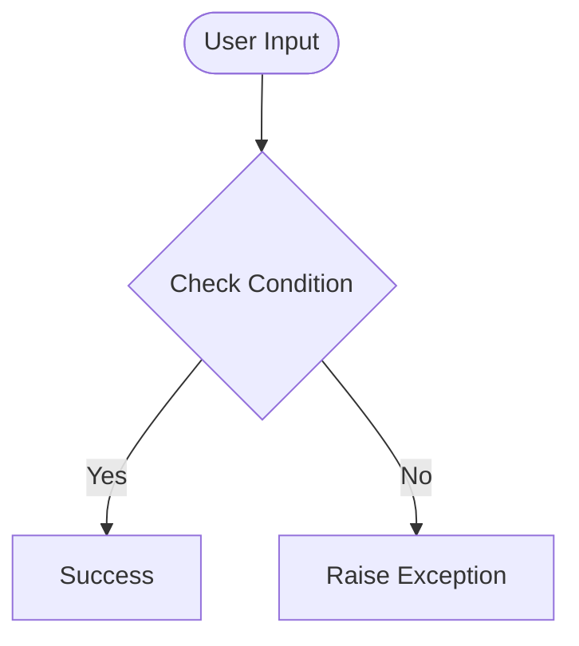

# Day 75 — Google Trends + Time Series Data <!-- omit in toc -->

[](../day_75/main.py)  

| **Scope** | **Description** |
|:---------:|:----------------|
|   Goal    | Analyze and compare Google Trends search popularity with real-world time-series data such as Bitcoin prices, Tesla stock prices, and US unemployment rates.          |
|   Steps   | Load and inspect multiple CSV datasets, identify and handle missing values, resample time series to matching periodicities, merge and compare related datasets, and visualize trends using customized Matplotlib charts with dual axes, date locators, grids, labels, markers, and styling.         |
|   Stack   | Python, Pandas, Matplotlib, time-series analysis, datetime indexes, resampling, NaN handling, Matplotlib Locators         |

## 📘 Table of contents <!-- omit in toc -->

- [🧠 Concepts Learned](#-concepts-learned)
- [⚠️ Challenges](#️-challenges)
- [✅ Solutions / Insights](#-solutions--insights)
- [📂 Project Structure](#-project-structure)
- [🏗 Architecture](#-architecture)
- [🎯 Next Steps](#-next-steps)

---

## 🧠 Concepts Learned

(Write bullet points here)

## ⚠️ Challenges

(What was confusing / hard)

## ✅ Solutions / Insights

(How you solved it / what finally clicked)

## 📂 Project Structure

```text
day_75/
├── main.py
├── config.py
```

## 🏗 Architecture



## 🎯 Next Steps

(Refactors, extra features, things to revisit)  

---
[](day_74.md) [](day_76.md)
