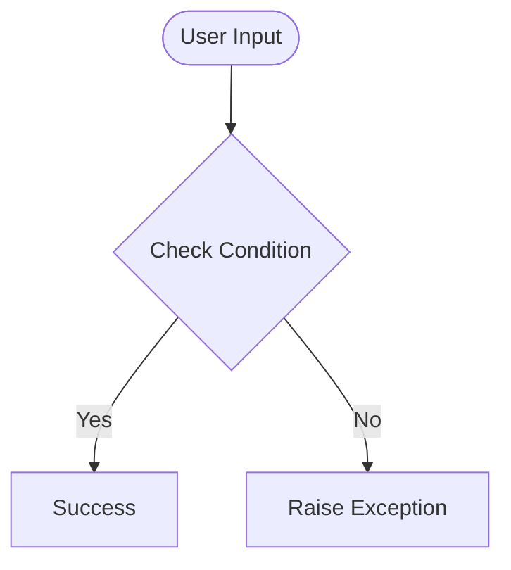

# Day 76 — Beautiful Plotly Charts & Analysis <!-- omit in toc -->

[](../day_76/main.py)  

| **Scope** | **Description** |
|:---------:|:----------------|
|   Goal    | Analyse Google Play Store data with Pandas and create interactive charts with Plotly.          |
|   Steps   | Clean and wrangle app data, then compare categories, downloads, pricing, and revenue.         |
|   Stack   | Python, Pandas, Plotly, Jupyter Notebook.         |

## 📘 Table of contents <!-- omit in toc -->

- [🧠 Concepts Learned](#-concepts-learned)
- [⚠️ Challenges](#️-challenges)
- [✅ Solutions / Insights](#-solutions--insights)
- [📂 Project Structure](#-project-structure)
- [🏗 Architecture](#-architecture)
- [🎯 Next Steps](#-next-steps)

---

## 🧠 Concepts Learned

(Write bullet points here)

## ⚠️ Challenges

(What was confusing / hard)

## ✅ Solutions / Insights

(How you solved it / what finally clicked)

## 📂 Project Structure

```text
day_76/
├── main.py
├── config.py
```

## 🏗 Architecture



## 🎯 Next Steps

(Refactors, extra features, things to revisit)  

---
[](day_75.md) [](day_77.md)
