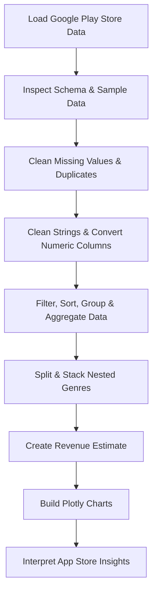

# Day 76 — Beautiful Plotly Charts & Analysis <!-- omit in toc -->

[](../day_76/main.py)

| **Scope** | **Description**                                                                       |
| :-------: | :------------------------------------------------------------------------------------ |
|   Goal    | Analyse Google Play Store data with Pandas and create interactive charts with Plotly. |
|   Steps   | Clean and wrangle app data, then compare categories, downloads, pricing, and revenue. |
|   Stack   | Python, Pandas, Plotly, Jupyter Notebook.                                             |

## 📘 Table of contents <!-- omit in toc -->

- [🧠 Concepts Learned](#-concepts-learned)
- [⚠️ Challenges](#️-challenges)
- [✅ Solutions / Insights](#-solutions--insights)
- [📂 Project Structure](#-project-structure)
- [🏗 Architecture](#-architecture)
- [🎯 Next Steps](#-next-steps)

---

## 🧠 Concepts Learned

- Inspected DataFrames with `.columns`, `.dtypes`, `.info()`, `.describe()`, `.head()`, and small schema-focused views.
- Identified missing values with `.isna()` / `.notna()` and removed incomplete rows with `.dropna()`.
- Found duplicate rows with `.duplicated()` and removed them with `.drop_duplicates()`.
- Used `.count()` for non-null values and `.value_counts()` for frequencies of unique values.
- Filtered rows with boolean masks, then sorted and selected top results with `.sort_values()` and `.head()`.
- Cleaned numeric-looking strings with `.str.replace()` before converting them with `.astype()` or `pd.to_numeric()`.
- Converted the `Installs` and `Price` columns from strings into numeric data suitable for calculations.
- Used `groupby()` to split data into groups and aggregation methods such as `count`, `sum`, `mean`, and `.agg()`.
- Learned the difference between dictionary aggregation and named aggregation:
  - `.agg({"Installs": "sum"})`
  - `.agg(total_installs=("Installs", "sum"))`
- Used `.loc` for label-based selection and reviewed the difference between `.loc` and `.iloc`.
- Used `.reset_index()` and `.set_index()` to move data between index and regular columns.
- Created derived columns such as `Revenue_Estimate = Price × Installs`.
- Compared when to use a direct aggregation versus combining separate results with `merge()`.
- Worked with nested values in `Genres` using `.str.split(..., expand=True)` and `.stack()`.
- Reinforced the structure of a Series: `.index`, `.values`, and `.items()`.
- Used Plotly to create pie, donut, bar, scatter, and box plots.
- Used logarithmic axes, category ordering, hover labels, bubble sizes, and reference lines to make charts easier to interpret.
- Added an overall median reference line to a box plot and compared it with the category-specific medians already shown inside each box.
- Used VS Code's Jupyter Variables/Data Wrangler views as a more convenient way to inspect DataFrames while working.

## ⚠️ Challenges

- Understanding why `pd.DataFrame(series)` creates a vertical structure while `pd.DataFrame([series])` turns the Series into a row.
- Remembering that many Pandas methods return a new object instead of modifying the original DataFrame automatically.
- Understanding why a boolean mask must belong to the same DataFrame being filtered.
- Distinguishing `count()` from `value_counts()` and knowing which one matches the analytical question.
- Understanding why strings such as `"1,000"` or `"$4.99"` must be cleaned before numeric conversion.
- Building the right mental model for `groupby()`: grouping alone does not summarise data until an aggregation is applied.
- Understanding why summing a string column concatenates text instead of counting rows.
- Keeping track of the exact DataFrame used in a chart, especially after creating filtered subsets such as paid apps or apps under `$250`.
- Understanding the difference between the dataset's structural labels (`Category == "GAME"`) and the real-world meaning of an app that may still be a game despite another category label.
- Understanding the shape changes caused by `.split(..., expand=True)` and `.stack()`, especially Series vs DataFrame output and the resulting MultiIndex.
- Avoiding unnecessary complexity while learning nested-data reshaping; the simple lesson was to split nested genres, stack them, and count the resulting values.
- Solving VS Code/Jupyter environment issues for Plotly rendering (`nbformat` and the Jupyter renderer).
- Recognising that static type-checking warnings from Pylance can differ from what Pandas successfully does at runtime.

## ✅ Solutions / Insights

- A Pandas operation is much easier to reason about when reading it as a sequence: **select → transform → aggregate → inspect**.
- Before assigning a transformation, check the shape of the object returned; a one-column destination cannot directly receive a two-column result.
- `groupby()` defines the groups; the following method (`count`, `sum`, `mean`, `agg`, `head`, etc.) defines what happens to those groups.
- Named aggregation is useful when the output column should have a clearer name, while dictionary aggregation is concise when keeping the original column name is fine.
- `value_counts()` is often the simplest tool when the question is "how often does each value occur?"
- Index labels are data labels, not spreadsheet row numbers. They can be moved back to columns with `.reset_index()` and restored with `.set_index()`.
- For nested genre data, the useful mental model is:
  - split the compound string,
  - expand it into separate positions,
  - stack those positions into one Series,
  - count the individual genre values.
- `value_counts()` ignores missing values by default, so the empty second genre slots do not need special handling for this challenge.
- A derived metric such as revenue should be created from aligned Series rather than with a Python loop.
- When the same grouping dimension is used for several metrics, a single `.groupby().agg(...)` can be cleaner than creating multiple DataFrames and merging them later.
- `merge()` remains important when the data genuinely comes from separate DataFrames or sources.
- A chart should always be debugged from the data source first: confirm the correct subset, measure, and scale before changing visual settings.
- Box plots show the distribution inside each category; the line inside each box is the category median, while an added horizontal line can show the global median.
- Data cleaning and modelling choices directly affect analysis: keeping a clean base DataFrame and deriving focused subsets is useful, but it requires being explicit about which branch is used later.

## 📂 Project Structure

```text
day_76/
├── config.py
├── Google Play Store App Analytics (start)
└── apps.csv
```

## 🏗 Architecture



## 🎯 Next Steps

- Move on to Day 77.
- Revisit `groupby().agg()` with a few small practice datasets until the split → aggregate → combine flow feels automatic.
- Practice reshaping nested data with `split`, `stack`, and indexes without overcomplicating the workflow.
- Keep using Plotly on small datasets to reinforce when to choose scatter, box, bar, pie, and donut charts.

---

[](day_75.md) [](day_77.md)
